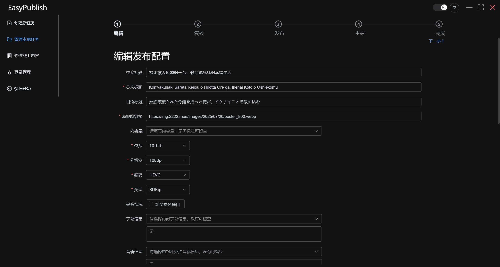
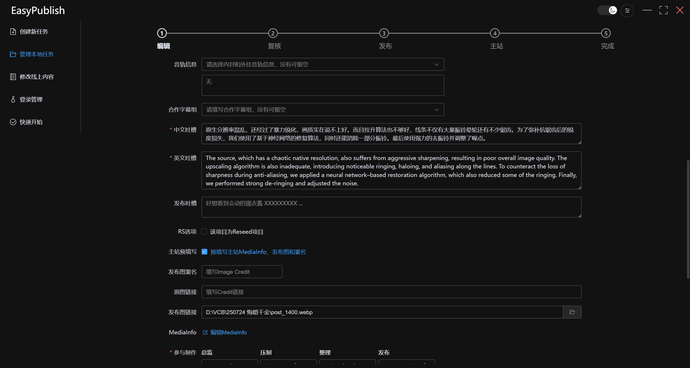
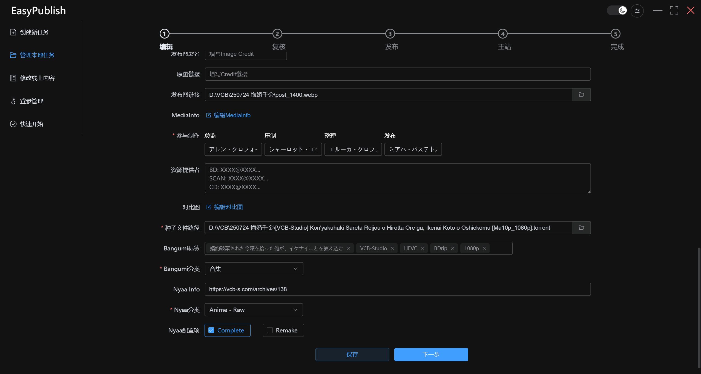
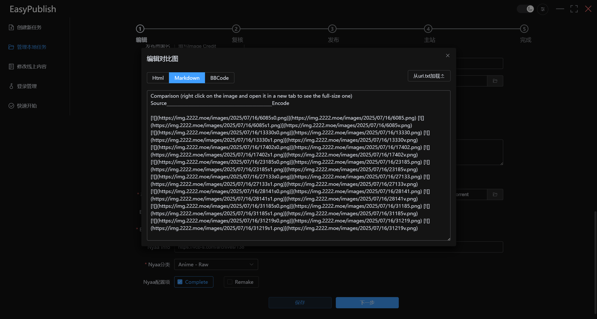
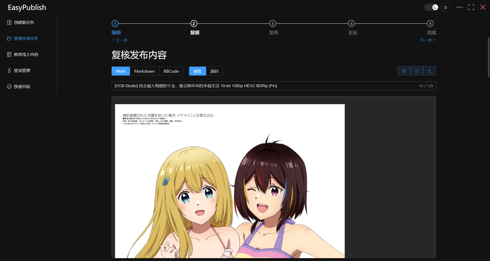
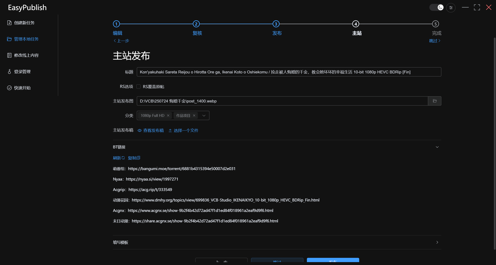
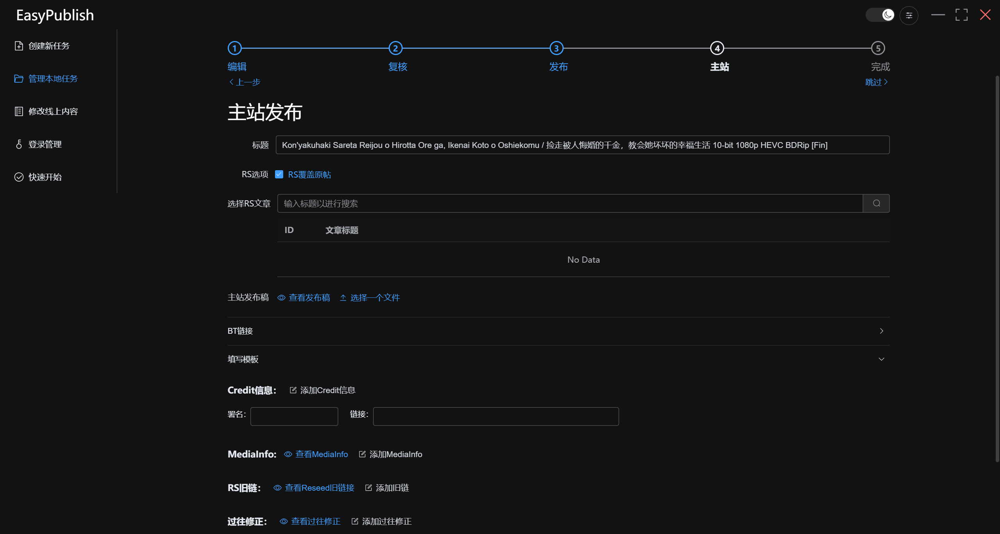
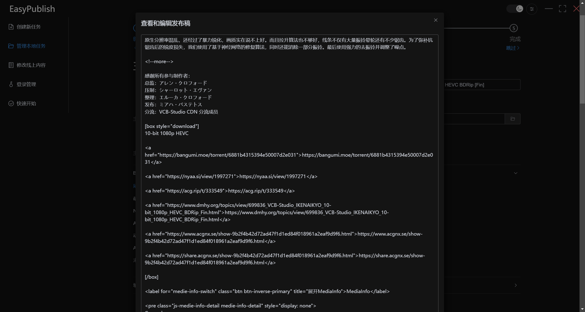
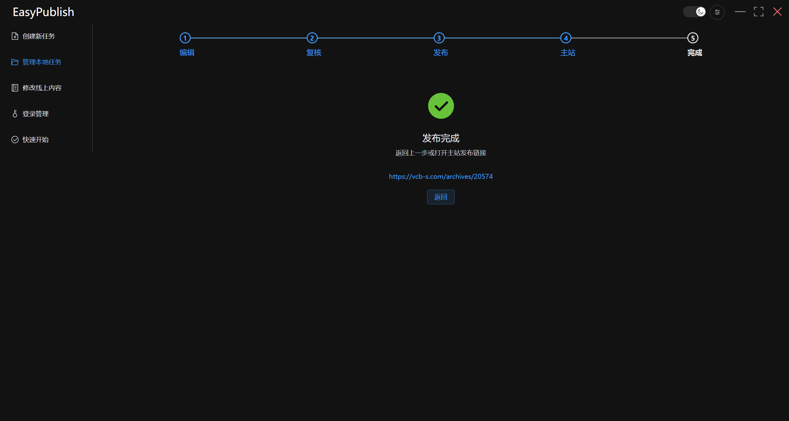

# 完整指南

## 1. 配置代理

EasyPublish 不会自动使用系统代理，请于右上方设置处配置代理设置，点击保存后重启应用。同时可切换主题（明亮/暗黑）。

## 2. 登录账户

于登录管理处启用账户，并填写对应用户名和密码，点击检查以检查登录状态并自动登录。其中，Nyaa、动漫花园、末日动漫及其国际站点需要在弹出的对话框完成人机验证。

你也可以点击打开网站手动完成登录。

若需使用主站发布功能，还需要在下方填写主站账户，应用程序密码需要前往主站 *仪表盘-个人资料-应用程序密码* 创建。

## 3. 发布

点击创建新任务，填写项目名称和保存路径。若留空则自动保存在运行目录下，并以创建时间命名，因此建议至少填写项目名称以便管理。

EasyPublish 支持三种任务类型，以满足不同需求的场景：

- 从模版创建*（推荐）*：提供项目信息，EasyPublish 会自动生成符合 *VCB-Studio 发布规范* 的发布稿，支持预览、公网发布、主站更新的全环节任务类型
- 从文件创建：需要自行撰写发布稿，支持预览、公网发布，主站更新时还需要您另外提供一份主站发布稿
- 快速发布：仅保留核心的公网发布功能，适用于非 VCB-S 标准的发布需求

### 3.1 从模版创建

以悔婚千金为例

#### 3.1.1 编辑项目信息

填写信息，具体内容参考[使用说明](./README.md)，特别注意一下几点：

- 内封字幕信息和音轨信息以其下方的输入框中的内容为准，若有偏差可手动编辑
- 合作字幕组以 wekan 上提供的名称为准，若有不同或未收录的可按照`中文名称/English Name`的格式添加
- 中英文吐槽的段落数需要保持一致，即一段中文对应一段英文
- 打开主站预填写（建议打开）可以填写主站发布稿需要的内容，也可以在后续发布时填写
- 需要同时填写三种格式的对比图，支持点击按钮从 txt 文件中直接加载
- 点击萌番组标签一栏将自动根据标题向萌番组获取标签，若有缺漏可以在该框内手动搜索（需要联网）

#### 3.1.2 复核发布内容

在此预览渲染后的发布稿。上方输入框可修改标题，修改立即生效。切换到源码选项，可以修改发布稿，点击右上保存按钮保存，点击刷新将重新加载发布稿，未保存的修改将不会被保留。点击导出按钮可以导出当前的发布稿，以供总监审核。

#### 3.1.3 公网发布

在此发布对应站点，萌番组支持单独发布和使用其团队同步功能两种模式，不要同时选中发布二者。萌番组获取同步链接和动漫花园的发布会有延迟，可能需要等待一段时间。

#### 3.1.4 主站更新

若编辑项目信息时启用主站预填写并填写信息，主站发布稿的内容应当已经完善。由于萌番组获取同步链接的延迟和动漫花园的发布延迟，存在 BT 站链接有缺少的可能，可以点击刷新再次获取，一旦获取完成，EasyPublish 将提示并自动将链接填入发布稿中。

若没有启用主站预填写，发布稿中可能仍然缺少 mediainfo 等信息，手动填入这些内容或者在填写模版中填写并点击对应的添加按钮。

若选择 RS 覆盖原贴，需要搜索并选择一个文章，EasyPublish 将自动获取该文章的 mediainfo、image credit、过往的重发修正和 BT 站链接，并自动为这些链接添加删除线标签，EasyPublish 会弹出一个对话框提示是否立即填入发布稿，除此之外可以在填写模版一栏看到这些内容，并可以手动添加这些内容到主站帖预留的位置处。点击发布将会用新的主站发布稿覆盖旧的内容。

点击发布会打开查看发布稿对话框，确认无误后于最下方点击确认并发布。此外，可以选择跳过主站发布。

#### 3.1.5 完成

若一切顺利，会得到一个主站链接。

### 3.2 从文件创建

仍然以悔婚千金为例

#### 3.2.1 编辑发布配置

填写标题，选择种子和发布稿文件。至少需要提供 html 格式的发布稿，若没有提供其他内容，EasyPublish 将自动转换生成对应的发布稿。

点击萌番组标签一栏将自动根据标题向萌番组获取标签，若有缺漏可以在该框内手动搜索（需要联网）。

#### 3.2.2 复核发布稿

同 3.1.2，但请注意，EasyPublish 会拷贝提供文件的副本，因此直接修改原文件并无作用，如需修改请在此处修改或返回上一页再点一次下一步。

#### 3.2.3 公网发布

同 3.1.3

#### 3.2.4 主站更新

操作界面与 3.1.4 完全相同，但没有填充任何内容，需要手动填写标题、发布图路径等。主站发布稿可以点击选择文件直接加载，BT 站链接处点击复制可复制 html 形式的链接以供填写。

#### 3.2.5 完成

同 3.1.5

### 3.3 快速发布

快速发布和从文件创建大致相同，但减少了两个不必要步骤。

#### 3.3.1 编辑发布配置

同 3.2.1

#### 3.3.2 公网发布

同 3.1.3

#### 3.3.3 完成

因快速发布没有主站发布功能，完成页面不会有链接。

## 4. 其他

如中途退出页面，可在管理本地任务处找到对应任务并继续。
