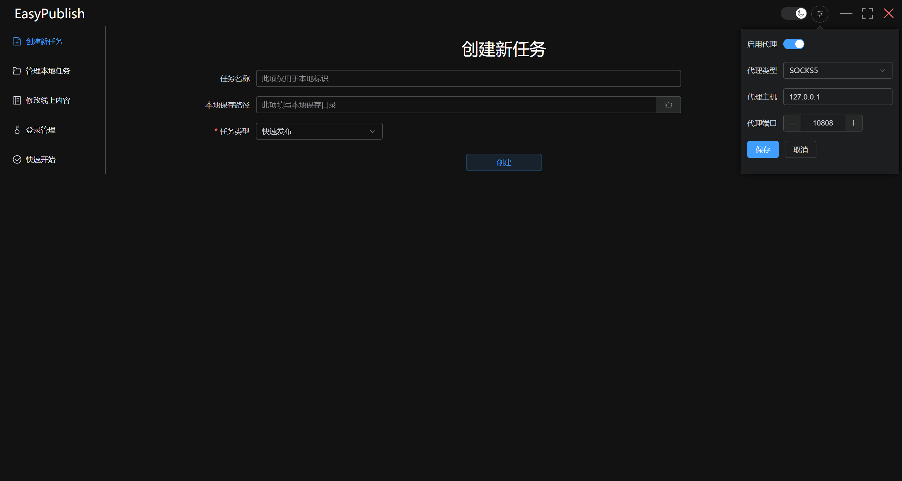
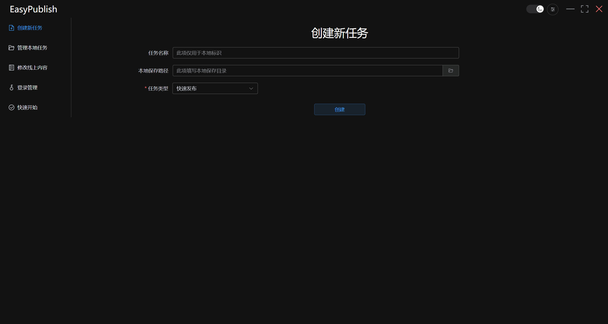
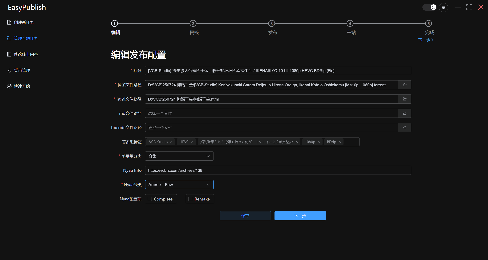
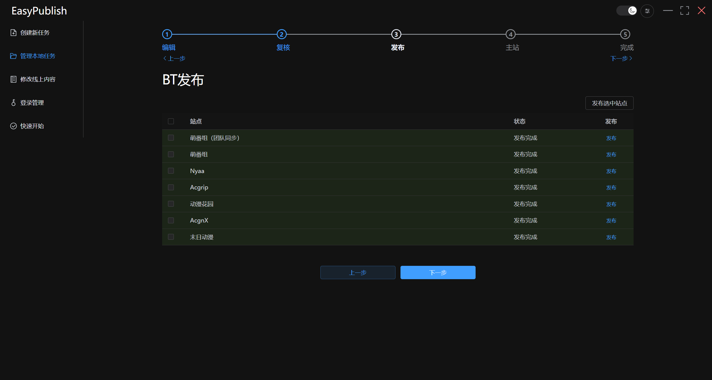

# 快速指南

## 发布前我应该做什么？

### 1.配置代理

代理设置位于右上角，EasyPublish 不使用系统代理，你需要先填写代理设置；如果你使用 VPN/TUN 或者可以直连各发布站点则可以跳过

### 2.登录账号

点击左侧登录管理，依次填入账号密码，并启用需要发布的账号，然后点击全部检查，完成弹出的人机验证框，最终显示账号已登录（绿色）即可

## 我应该怎样发布？

### 1.创建新任务

点击左侧创建新任务，随后直接点击创建，或者你也可以填一下名称。其他任务类型参见完整指南

### 2.编辑发布配置

依次填写你的发布内容，萌番组寄了的话可以不必写标签，但分类依旧要填

### 3.公网发布

依次点击对应站点的发布，等待发布完成即可

## 我应该去哪里找到我发布的链接？

点击左侧管理本地任务，勾选显示已完成项目，展开对应的行即可看到了。没有指定任务名称的会以创建时的时间显示（填写任务名称的重要性）。在链接处鼠标右键可以直接复制该链接

更多功能参见完整指南和项目首页
