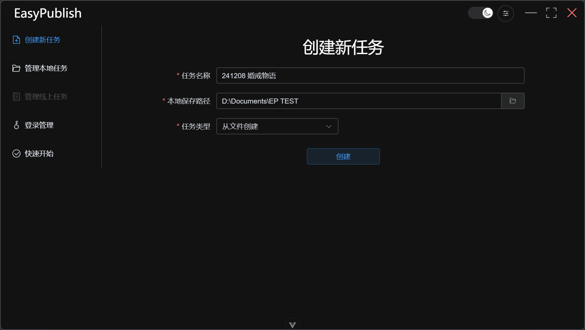
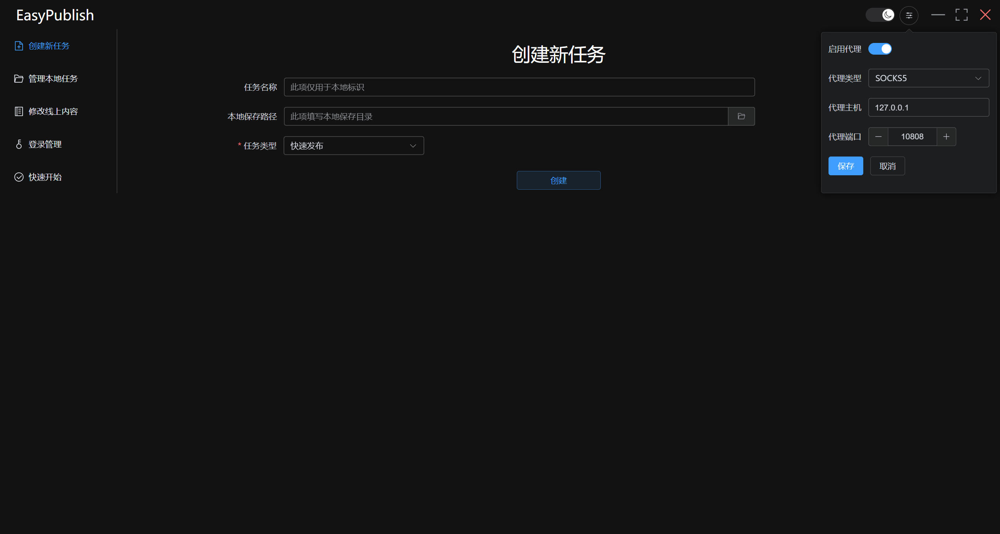
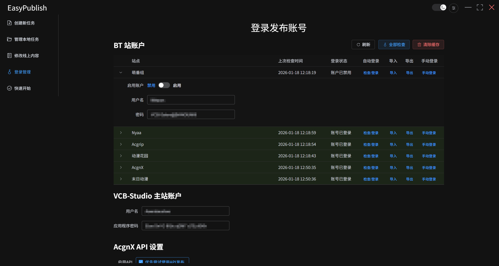
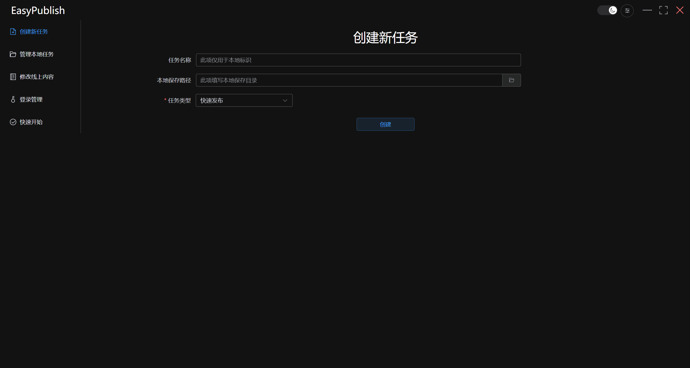
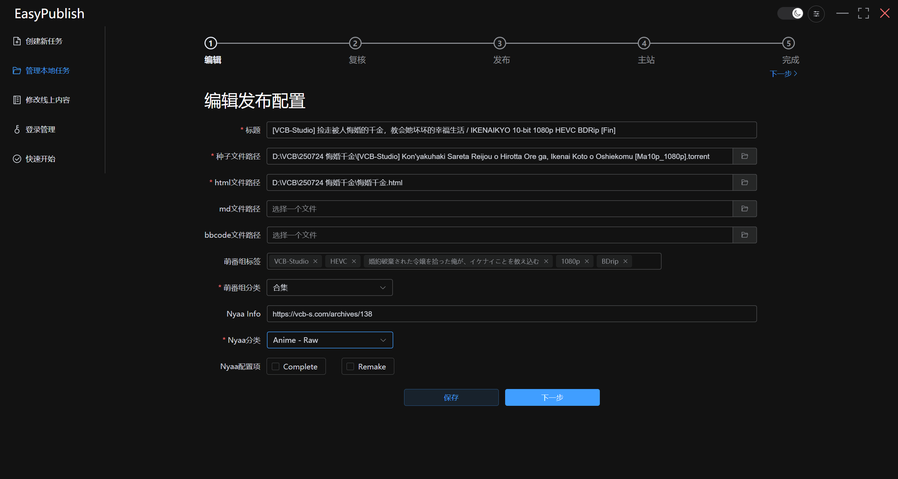
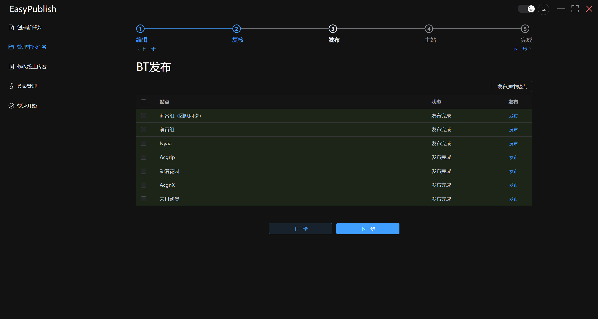
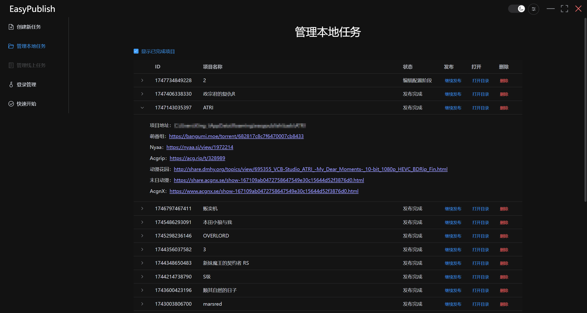

# Nexus Publish 新手教程


`Nexus Publish` 是一个面向 PT / NexusPHP 发布场景的桌面工具。它把“账号管理、项目编辑、内容检查、站点发布、结果回看”收进同一个工作区里，适合想把发布流程固定下来的人使用。

如果你是第一次接触这个项目，先看下面这句就够了：

> 推荐流程：先配代理和账号，再新建一个项目，填好内容后走完 `编辑 -> 检查 -> 发布 -> 完成`。

## 这个项目能做什么

- 把一次发布拆成可继续编辑的项目，而不是只跑一次性脚本
- 管理多个站点账号、Cookie、Token 和代理设置
- 支持剧集模式，以及合集 / 电影模式
- 用 Markdown 维护正文，并在发布时转换成 HTML / BBCode
- 保存每次发布结果，后面可以回看成功链接和失败记录

当前项目里常见的目标站点包括：

- 萌番组
- Mikan
- Anibt
- MioBT
- Nyaa
- AcgRip
- 动漫花园
- AcgnX
- 主站帖子流程

## 使用前先准备这些东西

- 你要发布的种子或资源文件
- 标题、简介、截图、技术信息等基础内容
- 对应站点的账号，或已经可用的 Cookie / Token
- 如果目标站点需要代理，先准备好代理地址

第一次使用时，建议先只选 `1` 个最熟悉的站点跑通流程，不要一上来就全站同时发布。

## 5 分钟上手

### 1. 安装或启动

普通使用者：

- 直接下载 Releases 里的安装包，安装后打开即可

本地运行源码：

```powershell
npm install
npm run dev
```



### 2. 先配置代理

如果你的发布站点需要代理，不要依赖系统代理，先在应用内把代理设置好。旧流程里很多登录、校验、发布问题，本质上都是代理没有先配好。



### 3. 添加并检查站点账号

进入 `站点账号` 页面后，把需要发布的站点账号先配置好，再执行检查。能在这里先发现的问题，不要拖到真正发布时再处理。

常见做法：

- 能用 Cookie / Token 的站点，优先填 Cookie / Token
- 需要用户名密码登录的站点，先确认验证码或二次验证流程能正常完成
- 检查状态异常时，先排查代理、Cookie 失效和站点登录状态



### 4. 新建项目

点击 `新建项目`，先决定这次发布属于哪种模式：

- `剧集模式`：适合连载、补档、分集维护
- `合集 / 电影`：适合单次成品、全集、电影、OVA、总集篇

然后再决定内容来源：

- `快速流程`：直接在当前工作流里填写内容，适合从零开始
- `从文件导入`：你已经准备好了 Markdown / HTML / BBCode 文件
- `模板生成`：希望基于模板字段自动组织发布内容



### 5. 编辑项目内容

项目创建完成后，按页面引导填写：

- 项目名称
- 发布标题
- 目标站点
- Markdown 正文
- 分类、标签、站点字段
- 种子路径、截图、补充说明

如果你是第一次用，先把内容填到“能发出去”的程度，不要一开始就追求把每个字段都自动化。



### 6. 检查输出

发布前先过一遍 `检查输出` 页面，重点看这几项：

- 标题是否最终可用
- HTML / Markdown / BBCode 的内容是否正常
- 目标站点是否都处于可发布状态
- 某些站点要求的分类、Bangumi 信息、额外字段是否缺失

这一步的意义很简单：把“上线后才发现的错误”尽量提前解决。

### 7. 发布种子

检查无误后进入 `发布种子`。应用会按当前项目配置，把内容发到你选中的目标站点，并记录每个站点的返回状态。

如果有站点失败，不需要整单重做，后面可以回到项目里继续补发。



### 8. 发布主站或结束流程

如果这次发布还需要同步主站帖子，就继续进入 `发布主站`。如果不需要主站流程，通常可以直接进入完成页查看结果。

### 9. 在完成结果里复制链接

发布完成后，去 `完成结果` 或项目列表里查看已经记录下来的远端链接和失败记录。后面补发、复查、复制链接，都从这里回看最方便。



## 项目模式怎么选

### 剧集模式

适合这些场景：

- 连载更新
- 一季内要反复补发
- 同一部作品会有多集、多版本、多次调整

这个模式更强调“持续维护一个工作区”。

### 合集 / 电影模式

适合这些场景：

- 单部电影
- 全集打包
- OVA、SP、剧场版
- 一次整理后就准备发布的成品内容

这个模式更强调“把一单内容整理完，然后一次走完流程”。

## 内容来源怎么选

### 快速流程

适合从零开始填表的人。你只要按界面顺序把字段补齐，就能直接走后续检查和发布。

### 从文件导入

适合已经有现成的 `Markdown`、`HTML`、`BBCode` 或历史发布稿的人。导入后再微调，比全部重写省时间。

### 模板生成

适合有固定写法、固定字段、固定站点信息的人。把常用结构模板化后，后续会轻松很多。

## 常见问题

### 为什么明明开了代理，还是登录失败？

先确认你是在应用里设置的代理，而不是只改了系统代理。这个项目的关键网络流程优先看应用内配置。

### 为什么有的站点能登录，但还是不能发布？

通常是发布字段还没补齐，例如分类、Bangumi 信息、标题、目标站点默认字段，或者该站点当前账号状态还不可用。

### 发布失败后要不要重建项目？

一般不用。这个项目就是为了把一次发布变成可继续编辑的工作区，失败后回到项目里修字段、补账号、重新发就行。

### 发布链接去哪里找？

去 `完成结果` 页面，或者项目列表里看项目详情。成功链接和失败记录都会保留。

### 看不懂哪里出错怎么办？

先看 `日志诊断`，再回到项目检查目标站点、标题、分类和账号状态。大部分问题都能在这两个地方定位到。

## 给第一次使用的人一点建议

- 先用一个测试项目熟悉流程，再处理正式发布
- 第一次只发一个站点，确认标题、分类和正文都正常
- Markdown 正文先保持简单，确认能稳定转换后再慢慢模板化
- 站点账号状态要先检查通过，不要边发布边排查登录问题

## 开发命令

如果你是来改代码或本地调试，可以直接用这些命令：

```powershell
npm install
npm run dev
npm run build
```

平台构建：

```powershell
npm run build:win
npm run build:mac
npm run build:linux
```

说明：

- `npm run build` 会先做类型检查，再执行 Electron 构建
- `npm run build:win` 会输出 Windows 安装包和更新元数据
- `npm run build:mac` 需要在 macOS 主机上执行
- `npm run build:linux` 当前会构建 Linux ARM64 的 `deb` 包

## 仓库结构

```text
src/
  main/        主进程服务、存储、站点适配器、IPC 注册
  preload/     预加载桥接与类型定义
  renderer/    桌面端界面、页面与功能模块
  shared/      项目、站点、发布相关共享类型
docs/          设计和重构过程文档
build/         打包资源与构建脚本
scripts/       辅助脚本
readme/        README 里用到的截图和图片
```

## 致谢

这个项目基于 `EasyPublish` 的思路继续演化而来。
